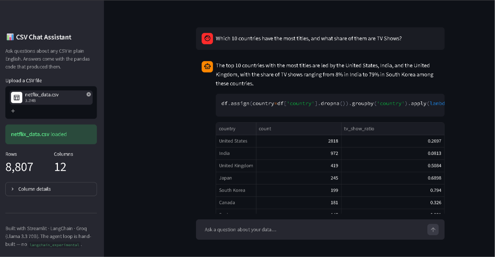
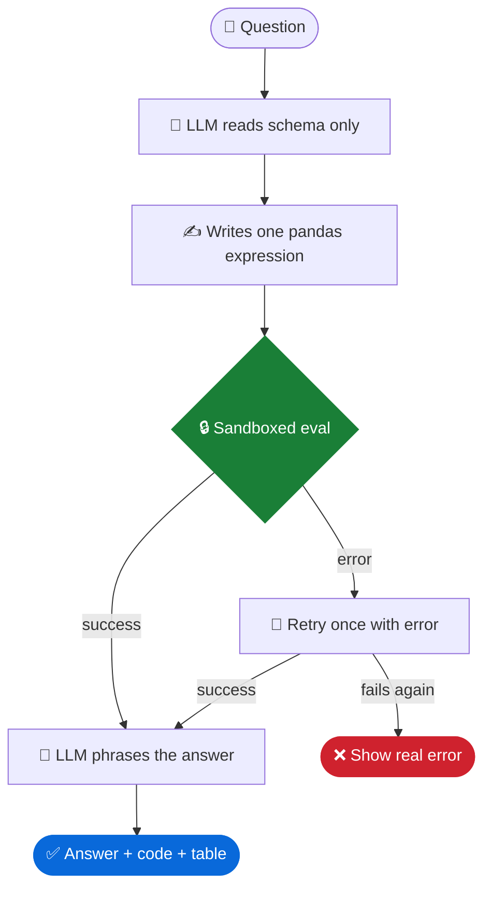
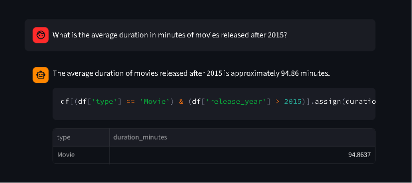
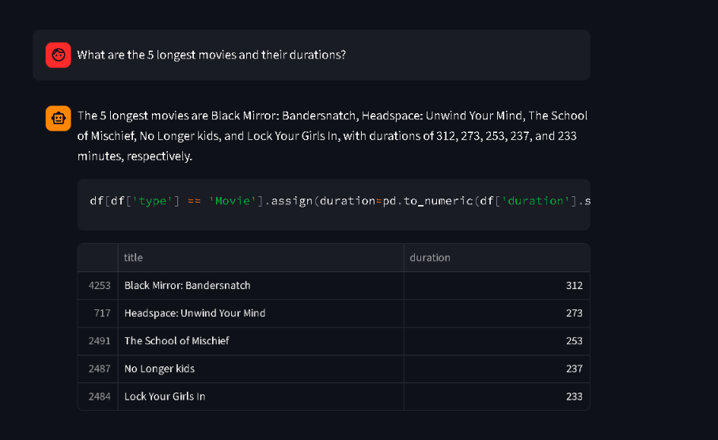
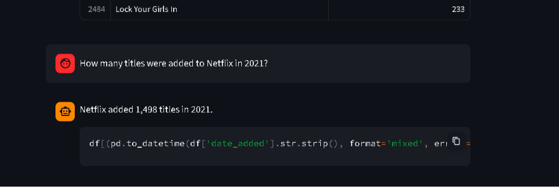
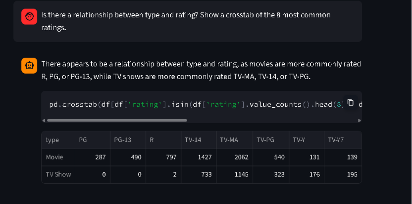
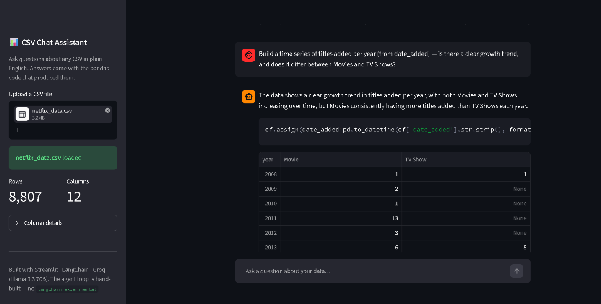

# 📊 CSV Chat Assistant — Chat with Any Dataset in Plain English

**Upload a CSV. Ask a question. Get the answer — *and the pandas code that computed it.***


Most "chat with your data" demos have a dirty secret: the LLM never actually computes anything — it guesses. This app doesn't guess. The LLM **writes one line of pandas code**, that code runs **in a sandbox against your real dataframe**, and the result comes back with the code displayed right under the answer. Every number is reproducible, every claim is auditable.



---

## How it works

### The core problem

An LLM can't "look at" a 10,000-row CSV — it would blow past the context window, and LLMs are bad at arithmetic over raw data anyway (they'd miscount rows and hallucinate averages). But pandas is *perfect* at arithmetic and terrible at understanding English questions.

So we split the job: **the LLM translates English → pandas code, and pandas does the actual math.** The LLM never sees your data in bulk — only its shape.

### The loop, turn by turn

Say the user asks *"What's the average rating of movies released after 2015?"*

1. **Reason** — We send the LLM a prompt containing the question plus the dataframe's **schema only**: column names, dtypes, and ~3 sample rows. That's a few hundred tokens regardless of whether the CSV has 100 rows or 10 million.
2. **Act** — The LLM is instructed to output exactly one pandas expression, e.g. `df[df['release_year'] > 2015]['rating'].mean()`. It does *not* answer the question directly — it can't, it hasn't seen the data.
3. **Observe** — Our code runs that expression against the real dataframe in a **sandbox**: an `eval()` with builtins stripped, no imports, no `os`/`sys`, no file access. The only thing in scope is `df`. This matters because we're executing code written by an LLM — the sandbox is the trust boundary of the whole app.
4. **Answer** — The raw result (say, `7.42`) goes back to the LLM: "the code returned 7.42, phrase this as a one-sentence answer."
5. **Retry once** — If the code crashes (LLM guessed a wrong column name, say), we feed the error message back: "your code failed with this error, fix it." One retry only — if it fails again we show the user the real error rather than a made-up answer. Unlimited retries would burn API quota looping on an unanswerable question.

This Reason → Act → Observe cycle is the **ReAct pattern** — here it is as a flowchart, hand-built in ~200 lines with no black-box agent framework:



Key properties:

- **The LLM never sees your data** — only the schema (column names, dtypes, 3 sample rows). A 10-million-row CSV costs the same tokens as a 10-row one, and your data stays private.
- **pandas does the math, not the LLM.** LLMs are unreliable at arithmetic over raw data; pandas is exact. The LLM is used only for what it's good at: translating English into code, and results into English.
- **Exactly one retry on failure.** The error message is fed back once; if the second attempt also fails, the user sees the *real* error. The app never invents a plausible-looking wrong answer.
- **Honest refusals.** Ask about data that isn't there ("Which titles won an Oscar?") and the agent returns a structured `UNANSWERABLE` response instead of hallucinating.

## Why not `create_pandas_dataframe_agent`?

LangChain's prebuilt pandas agent lives in `langchain_experimental` — a package that is **officially unmaintained**, with LangChain's own docs warning its examples "may be outdated or broken." This project deliberately builds the loop manually instead. That's not a missing feature; it's the point:

- The whole agent is ~200 readable lines I can explain, debug, and extend.
- The sandbox is *my* trust boundary, not an opaque dependency's.
- The prompt rules encode lessons learned from real messy data (see below).

## The sandbox

Executing LLM-generated code is the riskiest part of this design, so it runs behind three layers:

1. **`compile(code, mode="eval")`** — statements (`import os`, assignments, chained commands) are a syntax error before anything runs. Only a single expression is possible.
2. **Empty `__builtins__`** — the code's entire universe is two names: `df` and `pd`. `open()`, `__import__`, `exec` simply don't exist inside.
3. **Token denylist** — blocks dunder escapes (`__class__`-walking), `getattr` smuggling, and — a hole found by attacking my own sandbox — **pandas' own file I/O** (`pd.read_csv` can read arbitrary disk paths, so all `read_*`/`to_*` disk methods are rejected).

## Demo — 5 questions, 5 pandas patterns

Tested live against a real Netflix catalog dataset (8,807 rows × 12 columns).

| # | Pattern | Question |
|---|---------|----------|
| 1 | groupby + aggregation | Which 10 countries have the most titles, and what share are TV Shows? |
| 2 | filter + mean | Average duration of movies released after 2015? |
| 3 | sort + head | The 5 longest movies and their durations? |
| 4 | filter + count | How many titles were added to Netflix in 2021? |
| 5 | crosstab | Is there a relationship between type and rating? |

**1 — groupby + aggregation** — see the hero screenshot above. US leads with 2,818 titles; TV-show share ranges from 8% (India) to 79% (South Korea).

**2 — filter + mean**



**3 — sort + head** — *Black Mirror: Bandersnatch* (312 min) tops the list.



**4 — filter + count** — note the generated code: it strips whitespace and parses dates with `format='mixed'`, because this dataset's `date_added` column hides a leading space that breaks naive parsing.



**5 — crosstab** — movies dominate PG/PG-13/R; TV skews TV-MA/TV-14. (Only **2** R-rated TV shows exist in the entire catalog.)



**Bonus: a genuinely hard question.** *"Build a time series of titles added per year — does the trend differ between Movies and TV Shows?"* requires date parsing, null handling, a two-level groupby, and a pivot — generated and executed as a single expression:



## Battle scars: prompt rules learned from real data

The first version handled clean questions fine and fell over on real-world mess. Each failure became a permanent rule in the code-generation prompt:

| Failure | Rule now in the prompt |
|---|---|
| `" August 4, 2017"` (leading space) broke strict date formats | Always `pd.to_datetime(col.str.strip(), format='mixed', errors='coerce')` |
| `.astype(int)` crashed on titles with missing durations | Extract numbers with `pd.to_numeric(..., errors='coerce')` |
| "Build a time series" made the LLM call `.plot()` | Never plot — return the grouped data; the UI renders tables |
| Comma-separated `cast` cells | `.str.split(', ')` + `.explode()` before grouping |
| Vague "tell me about this data" | Fall back to `df.describe(include='all')` |

## Setup & run

```bash
git clone https://github.com/arnavvpareek/csv-chat-assistant.git
cd csv-chat-assistant
python -m venv venv
venv\Scripts\activate        # Windows  (source venv/bin/activate on macOS/Linux)
pip install -r requirements.txt
```

Create a free API key at [console.groq.com](https://console.groq.com), then create a `.env` file in the project root:

```
GROQ_API_KEY=your_key_here
```

Run:

```bash
streamlit run app.py
```

Upload any CSV and start asking questions.

## Project structure

```
├── agent.py          # Sandboxed executor + ReAct agent loop (~200 lines)
├── app.py            # Streamlit chat UI
├── requirements.txt  # Pinned dependencies
├── screenshots/      # Demo evidence
└── .env              # Your Groq API key (git-ignored)
```

## Limitations (the honest section)

1. **The sandbox is a guardrail, not a jail.** A restricted in-process `eval` reliably stops an LLM going off-script, but no eval sandbox can fully contain a determined human attacker. A production version would run generated code in an isolated subprocess or container.

2. **One expression, no memory.** Multi-stage analyses don't fit in a single pandas expression, and each question is answered from scratch — a follow-up like *"now break that down by year"* won't know what "that" refers to. Fixing this needs a plan-and-execute loop, at the cost of the simplicity that makes this design auditable.

3. **Ambiguous columns can mislead.** The LLM sees only the schema, so a column like `rating` (content rating? user score?) can be misread — producing a correct-looking answer to the wrong question. The displayed code exists so users can catch exactly this.

---

*Built by [Arnav Pareek](https://github.com/arnavvpareek) — Python · LangChain · Groq · Streamlit*
